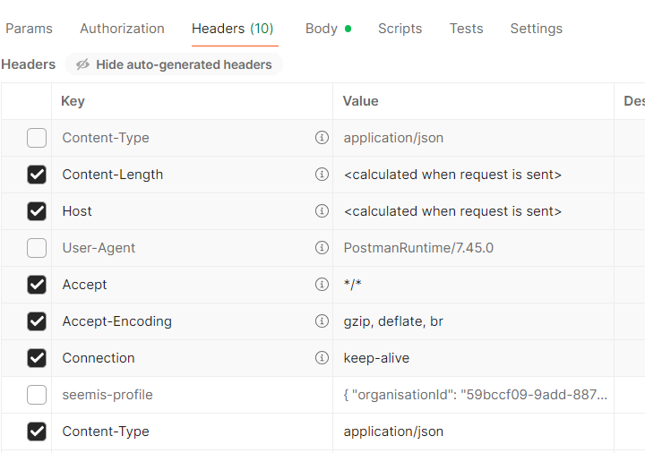
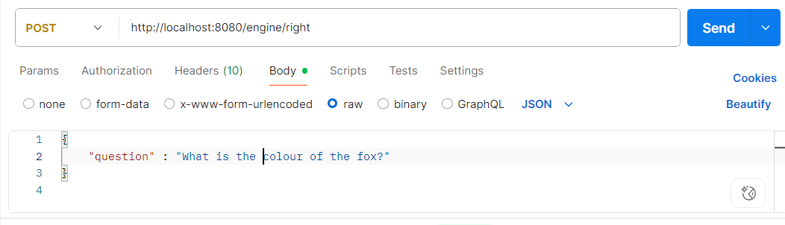

BERTQuestionAnswering
---------------------

download https://www.openlogic.com/openjdk-downloads OpenJDK17

download git https://git-scm.com/downloads

git clone https://github.com/CharlieSwires/BertQuestionsAnswers

Load python interpreter https://www.python.org/downloads

py -m pip install --upgrade pip

py -m pip install transformers

py -m pip install torch --index-url https://download.pytorch.org/whl/cpu

cd BertQuestionsAnswers/src/main/python

edit test2.pt OUT_DIR = r"C:\Users\Dell\eclipse-workspace\bert\BertQuestionsAnswers\src\main\python" to be the correct path

py test2.pt

cd ../java/com/charlie

edit BertQuestionAnswering.java alter the path 			    .optModelPath(Paths.get("C:\\Users\\Dell\\eclipse-workspace\\bert\\BertQuestionsAnswers\\src\\main\\python\\traced.pt")) // <-- the .pt file itself

cd ../../..

download https://maven.apache.org/download.cgi

mvn clean package

cd target

java -jar bert-questions-answers.jar

download and run https://www.postman.com/downloads set the headers as follows

ask your question as below:

